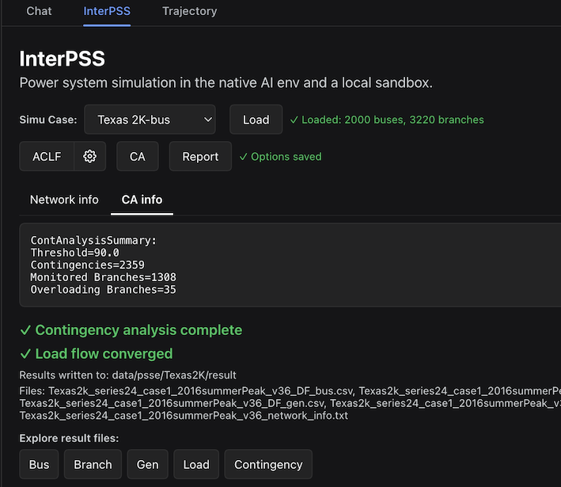
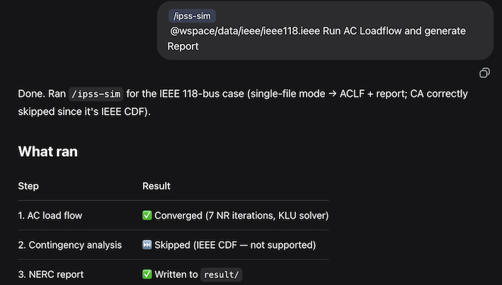

# iPSS Agent

**[InterPSS Agentic Power System Simulation Agent](https://tinyurl.com/interpss)** for AC load flow, DC-based contingency analysis, and NERC TPL-001-5 style reporting. This repository ships agent-facing skills for **OpenAI Codex Desktop**, **Claude Code CLI**, and **DeepSeek Harness** (build and CLI details in [Setup.md](Setup.md); DSH plugin in [InstallDSHPlugin.md](InstallDSHPlugin.md)). The canonical skill is `[.agents/skills/ipss-sim/SKILL.md](.agents/skills/ipss-sim/SKILL.md)`; run `./scripts/sync_ipss_skills.sh` after edits to refresh `.claude/skills/ipss-sim/SKILL.md`.

It is also integrated into DeepSeek Harness as a DSH Plugin. You can run power system simulation in the traditional step-by-step way ([plugin user guide](docs/plugin_user_guide.md)):



Or in the native AI Chat way ([agent chat user guide](docs/agent_chat_user_guide.md)):



## Environment setup

**Prerequisites:** Java JDK 21, Maven (or the included `mvnw` wrapper).

Prompt Codex, Claude Code, or DeepSeek Harness to clone and build **ipss-agent**:

```text
Install(Update) and setup ipss-agent from https://github.com/InterPSS-Project/ipss-agent
```

Depending on your network speed, it may take some time to download dependencies and build the CLI.

Build the Java CLI from the project root:

```bash
./mvnw -q clean package
```

This produces `target/ipss-agent-cmd-1.0.0-uber.jar`. See [Setup.md](Setup.md) for the full layout, tests, and configuration.

Test the setup with a sample case directory:

```text
init  # for the first time installation
/ipss-sim data/ieee/Ieee118Bus/ "IEEE 118-Bus Test Case"
```


#### DSH Plugin setup

Prompt DeepSeek Harness to install InterPSS DSH plugin:

```text
Install(update) InterPSS DSH plugin
```

## User Guide

- InterPSS DSH Plugin user guide [plugin_user_guide.md](docs/plugin_user_guide.md), [plugin_user_guide.md](docs/plugin_user_guide.pdf)           
- iPSS Agent Chat user guide [agent_chat_user_guide.md](docs/agent_chat_user_guide.md)

## Reference


| Topic                             | Document                                                                                   |
| --------------------------------- | ------------------------------------------------------------------------------------------ |
| Layout, build, JARs, agent skills | [Setup.md](Setup.md)                                                                       |
| `IpssCmd` (Java CLI) usage        | [IpssCmd.md](IpssCmd.md)                                                                   |
| Markdown report generator         | [GenReport.md](GenReport.md)                                                               |
| DeepSeek Harness DSH plugin       | [InstallDSHPlugin.md](InstallDSHPlugin.md)                                                 |
| Interactive HTML dashboards       | `[.agents/skills/nerc-report-html/SKILL.md](.agents/skills/nerc-report-html/SKILL.md)`     |
| NERC slide decks                  | `[.agents/skills/nerc-report-slides/SKILL.md](.agents/skills/nerc-report-slides/SKILL.md)` |


