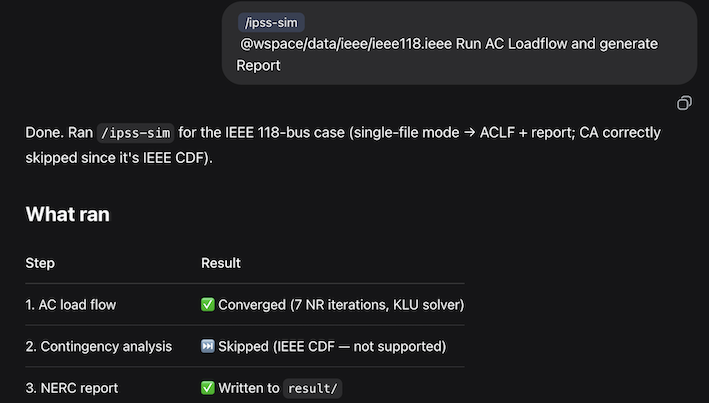
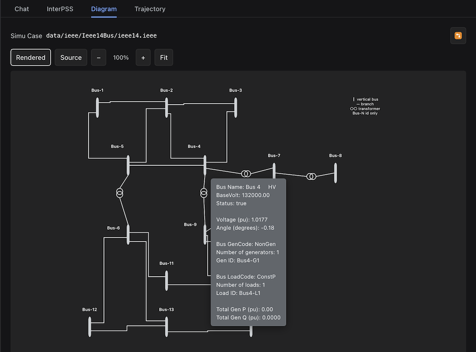

# iPSS Agent

**[InterPSS Agentic Power System Simulation Agent](https://tinyurl.com/interpss)** for AC load flow, DC-based contingency analysis, and report generation, including NERC TPL-001-5 style. This repository ships agent-facing skills for **OpenAI Codex Desktop** and **DeepSeek Harness** (build and CLI details in [Setup.md](Setup.md); DSH plugin in [InstallDSHPlugin.md](InstallDSHPlugin.md)). The batch run canonical skill is `[.agents/skills/ipss-sim/SKILL.md](.agents/skills/ipss-sim/SKILL.md)`. (see [batch chat user guide](docs/user_guide/batch_chat_user_guide.md) for details):



It is also integrated into DeepSeek Harness as a DSH Plugin. You can run power system simulation in the traditional step-by-step way in a local sandbox ([DSH plugin user guide](docs/user_guide/dsh_plugin_user_guide.md)):


The simulation results can be visualized in a one-line diagram:



## Environment setup

**Prerequisites:** Java JDK 21, Maven (or the included `mvnw` wrapper).

Prompt Codex, Claude Code, or DeepSeek Harness to clone and build **ipss-agent**:

```text
Install(Update) and setup ipss-agent from https://github.com/InterPSS-Project/ipss-agent
```

Depending on your network speed, it may take some time to download dependencies and build the CLI.

Build the Java CLI from the project root:

```bash
./mvnw -q clean package
```

This produces `target/ipss-agent-cmd-1.0.0-uber.jar`. See [Setup.md](Setup.md) for the full layout, tests, and configuration.

Test the setup with a sample case directory:

```text
init  # for the first time installation
/ipss-sim data/ieee/Ieee118Bus/ "IEEE 118-Bus Test Case"
```


#### DSH Plugin setup

Install DeepSeek Harness (Desktop version is recommended). Prompt DeepSeek Harness to install InterPSS DSH plugin:

```text
Install(update) InterPSS DSH plugin
```
Open the iPSS Agent folder as a workspace in DSH. You can then run the power system simulation workflow or chat following the DSH plugin user guide.


## User Guide

- InterPSS DSH Plugin user guide [dsh_plugin_user_guide.md](docs/user_guide/dsh_plugin_user_guide.md)
- InterPSS One-Line Diagram user guide [oneline_diagram_user_guide.md](docs/user_guide/oneline_diagram_user_guide.md)
- InterPSS Loadflow Adjustment user guide [loadflow-adjustment-user-guide.md](docs/user_guide/loadflow-adjustment-user-guide.md)
- iPSS Agent Chat (Batch) user guide [batch_chat_user_guide.md](docs/user_guide/batch_chat_user_guide.md)

## Tutorial Video

- [1 Install InterPSS DSH Plugin and run /ipss-sim](https://youtu.be/welo0g3OT3s)

- [2 Run InterPSS in GUI or Chat Model](https://youtu.be/PGy_3Cq-ptQ)

- [3 Run Loadflow Adjustment](https://youtu.be/RfymNnoaJ0Y)

- [4 Use or Create Oneline Diagram](https://youtu.be/dnOhrwHh_6c)


## Release notes

- Latest: [Release-V0.7.0.md](docs/release_note/Release-V0.7.0.md) (`@deepseek-ai/dsh-interpss` **0.7.0**)
- Earlier: [docs/release_note/](docs/release_note/)


## Reference


| Topic                                     | Document                                                                                   |
| ----------------------------------------- | ------------------------------------------------------------------------------------------ |
| Layout, build, JARs, agent skills         | [Setup.md](Setup.md)                                                                       |
| `IpssCmd` (Java CLI) usage                | [IpssCmd.md](IpssCmd.md)                                                                   |
| Markdown report generator                 | [GenReport.md](GenReport.md)                                                               |
| DeepSeek Harness DSH plugin               | [InstallDSHPlugin.md](InstallDSHPlugin.md)                                                 |
| DSH plugin package                        | [interpss-persistent/README.md](interpss-persistent/README.md)                             |
| InterPSS chat tools                       | [docs/interpss-tools.md](docs/interpss-tools.md)                                           |
| Interactive HTML dashboards               | `[.agents/skills/nerc-report-html/SKILL.md](.agents/skills/nerc-report-html/SKILL.md)`     |
| NERC slide decks                          | `[.agents/skills/nerc-report-slides/SKILL.md](.agents/skills/nerc-report-slides/SKILL.md)` |
| Load a simulation case into the bridge    | [.agents/skills/ipss-case-load/SKILL.md](.agents/skills/ipss-case-load/SKILL.md)           |
| Run DC contingency analysis for the current case | [.agents/skills/ipss-case-ca/SKILL.md](.agents/skills/ipss-case-ca/SKILL.md)             |
| Current case network info                 | [.agents/skills/ipss-case-info/SKILL.md](.agents/skills/ipss-case-info/SKILL.md)           |
| Run ACLF for the current case             | [.agents/skills/ipss-case-aclf/SKILL.md](.agents/skills/ipss-case-aclf/SKILL.md)           |
| Adjust load Q to a bus-voltage band       | [.agents/skills/ipss-case-aclf-adjust/SKILL.md](.agents/skills/ipss-case-aclf-adjust/SKILL.md) |
| Summary report for the current case       | [.agents/skills/ipss-case-summary/SKILL.md](.agents/skills/ipss-case-summary/SKILL.md)     |
| Run a scenario script on the current case | [.agents/skills/ipss-case-script/SKILL.md](.agents/skills/ipss-case-script/SKILL.md)       |
| Draw a one-line diagram for the case      | [.agents/skills/ipss-case-diagram/SKILL.md](.agents/skills/ipss-case-diagram/SKILL.md)     |


