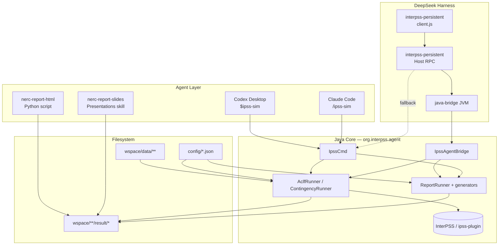

# ipss-agent Architecture

This document describes the system design of **ipss-agent**: an agent-facing power-system simulation workspace built around a native Java CLI, Markdown report generators, LLM skills, and an optional DeepSeek Harness (DSH) browser plugin.

For build and run instructions, see [Setup.md](../Setup.md). For CLI syntax, see [IpssCmd.md](../IpssCmd.md). For in-process Node↔Java integration details, see [js-java-integration.md](js-java-integration.md).

---

## Overview

ipss-agent wraps InterPSS (Java) to provide three invocation surfaces over a **single simulation core**:

| Surface | Audience | Mechanism |
|---------|----------|-----------|
| **CLI** (`IpssCmd`) | Developers, scripts, CI | `java -jar target/ipss-agent-cmd-1.0.0-uber.jar …` from `wspace/` |
| **Agent skills** | Codex Desktop, Claude Code | Natural-language orchestration that shells out to the CLI |
| **DSH plugin** | DeepSeek Harness web GUI | Cordis Host RPC → `java-bridge` → `IpssAgentBridge` (with CLI fallback) |

All surfaces share the same path conventions, configuration files, CSV output layout, and report generators.



---

## Repository Layout

```
ipss-agent/
├── src/main/java/org/interpss/agent/   # CLI, bridge, runners, reports
├── src/test/java/                       # JUnit 5 tests + golden reports
├── src/assembly/uber.xml                # Uber JAR assembly descriptor
├── config/                              # aclf_run.json, gen_report.json
├── lib/                                 # ipss_runnable.jar, deps/, m2-repo/
├── wspace/                              # Working directory (cases + results)
├── target/                              # ipss-agent-cmd-1.0.0-uber.jar
├── .agents/skills/                      # Canonical agent skills (Codex)
├── .claude/commands/ + .claude/skills/  # Claude Code integration
├── interpss-persistent/                 # DSH persistent Cordis plugin
├── interpss-dynamic/                    # Legacy dynamic DSH injection (superseded)
├── scripts/                             # sync_ipss_skills.sh, bridge setup
└── docs/                                # Architecture and integration notes
```

| Path | Role |
|------|------|
| `wspace/` | All simulation paths are relative to this directory. Case files live under `wspace/data/`; outputs under `<case_parent>/result/`. |
| `config/` | Project-wide defaults for ACLF solver settings and report thresholds. |
| `lib/` | Prebuilt InterPSS runtime JARs; Maven also resolves from `lib/m2-repo/`. |
| `.agents/skills/` | Source-of-truth skill definitions consumed by Codex and referenced by Claude commands. |

---

## Java Core

### Entry point: `IpssCmd`

`org.interpss.agent.IpssCmd` is the CLI main class packaged in the uber JAR. It dispatches two command families:

```
java -jar …/ipss-agent-cmd-1.0.0-uber.jar <aclf|ca> <ieee|psse> <input> [cont_file monitor_file]
java -jar …/ipss-agent-cmd-1.0.0-uber.jar report <nerc|aclf> "<display_name>" <result_dir> [csv_prefix]
```

| Component | Package | Responsibility |
|-----------|---------|----------------|
| `IpssCmd` | root | Parse args, discover project root, delegate to runners or `ReportRunner` |
| `CliArgs`, `ReportCliArgs` | `cli` | Argument parsing and usage text |
| `ProjectPaths` | `util` | Resolve `wspace/`, result dirs, ACLF config lookup |
| `NetworkLoader` | `input` | Route to format-specific adapters |
| `IeeeFileAdapter`, `PsseFileAdapter` | `input` | Import `.ieee` / `.raw` via `IpssAdapter` |
| `AclfRunner` | `runner` | Newton–Raphson AC load flow → CSV + network info |
| `ContingencyRunner` | `runner` | DC N-1 contingency → contingency CSV |
| `ReportRunner` | `report` | Orchestrate Markdown report generation |
| `IpssAgentBridge` | `bridge` | In-process JSON facade for DSH `java-bridge` |
| `SimuModelRepository` | `model` | Cache one base-case `AclfNetwork` in memory |

### Package dependency direction

```
IpssCmd / IpssAgentBridge
    → runner (AclfRunner, ContingencyRunner)
    → report (ReportRunner, *Generator, *Analyzer)
    → input (NetworkLoader, *Adapter)
    → util (ProjectPaths, IpssNetworkInfo)
    → org.interpss.plugin.* / com.interpss.core.*  (InterPSS engine)
```

Agent code does **not** reimplement power-flow math. It orchestrates InterPSS plugin classes (`IpssAdapter`, `LoadflowAlgorithm`, `ParallelDclfContingencyAnalyzer`, `AclfNetDFrameAdapter`, etc.) and formats outputs.

---

## Simulation Data Flow

### Step 1 — Load case

```
.ieee / .raw  →  NetworkLoader.loadNetwork(format, path)
              →  IeeeFileAdapter | PsseFileAdapter
              →  IpssAdapter.importAclfNet()
              →  AclfNetwork
```

Supported formats: `ieee` (IEEE Common Format / CDF) and `psse` (PSS/E RAW).

### Step 2 — AC load flow (ACLF)

```
AclfRunner.runOnNet(net, configPath, resultsDir, stem)
  1. AclfRunConfigRec.loadAclfRunConfig(configPath)
  2. LoadflowAlgorithm.loadflow()
  3. Write stem_network_info.txt
  4. AclfNetDFrameAdapter → stem_DF_{bus,branch,gen,load}.csv
```

**ACLF config resolution** (two-tier, printed as `Using config file: …`):

1. Case-specific: `wspace/<input_parent>/config/aclf_run.json`
2. Project default: `config/aclf_run.json`

### Step 3 — Contingency analysis (CA, optional)

```
ContingencyRunner.run(paths, cli, net, resultsDir, stem)
  1. Load contingency + monitored-branch JSON (ContingencyFileUtil)
  2. ParallelDclfContingencyAnalyzer
  3. DclfContingencyDFrameAdapter → stem_DF_contingency.csv
```

CA requires both JSON companion files. The agent skill auto-discovers them in directory mode by filename patterns (`*contingency*`, `*monitor*`).

### Step 4 — Report generation

Reports are **CSV-driven** — generators analyze exported DataFrame CSVs; they do not re-run load flow.

```
ReportRunner.run(type, displayName, resultDir, csvPrefix)
  ├─ AclfReportGenerator   → AC_Loadflow_Report.md
  └─ NercTplReportGenerator → NERC_TPL_001_5_Report.md
```

Analyzers (`VoltageAnalyzer`, `BranchLoadingAnalyzer`, `GeneratorQAnalyzer`, `ContingencyAnalyzer`) apply thresholds from `config/gen_report.json`.

### Step 5 — Follow-on artifacts (optional)

| Skill | Input | Output |
|-------|-------|--------|
| `nerc-report-html` | `NERC_TPL_001_5_Report.md` + CSVs | Interactive Plotly HTML dashboard |
| `nerc-report-slides` | NERC Markdown report | PowerPoint slide deck |

---

## Path and Output Conventions

`ProjectPaths` discovers the project root by locating co-located `wspace/` and `config/` directories (from project root or from inside `wspace/`).

| Concept | Example |
|---------|---------|
| Case input (relative to `wspace/`) | `data/ieee/Ieee118Bus/ieee118.ieee` |
| Input parent | `data/ieee/Ieee118Bus` |
| Result directory | `wspace/data/ieee/Ieee118Bus/result/` |
| Output stem | `ieee118` (basename without extension) |

**Standard result files** (under `<input_parent>/result/`):

| File | Produced by |
|------|-------------|
| `<stem>_network_info.txt` | ACLF |
| `<stem>_DF_bus.csv` | ACLF |
| `<stem>_DF_branch.csv` | ACLF |
| `<stem>_DF_gen.csv` | ACLF |
| `<stem>_DF_load.csv` | ACLF |
| `<stem>_DF_contingency.csv` | CA |
| `AC_Loadflow_Report.md` | `report aclf` |
| `NERC_TPL_001_5_Report.md` | `report nerc` |

Legacy layout `wspace/result/<subdir>/` is still supported by `ReportCaseResolver` for older workflows.

---

## In-Process Bridge

`IpssAgentBridge` exposes a JSON API for the DSH Host so Node.js never touches EMF/`AclfNetwork` objects directly.

| Method | Purpose |
|--------|---------|
| `loadCase(format, absCasePath)` | Load network into `SimuModelRepository` |
| `runAclf(format, absCasePath, absConfigPath, absResultsDir, stem)` | Reuse cached net when path matches; call `AclfRunner.runOnNet()` |
| `summarize(scope, sortRule, numRec)` | In-memory result summary via `AclfResultAdapter` |
| `getNetworkInfo()` | Text network summary |
| `runReport(reportType, displayName, projectRoot, resultDirRelative, csvPrefix)` | Delegate to `ReportRunner` |
| `clear()` | Release cached network |

Design principles:

- **Single simulation core** — `AclfRunner.runOnNet()` is shared by CLI and bridge.
- **JSON boundary** — all bridge returns are JSON strings (or plain text for network info).
- **Synchronized** — one `SimuModelRepository` per bridge instance; concurrent RPCs serialize.

See [js-java-integration.md](js-java-integration.md) for the planned migration from shell-out to full in-process CA/report coverage in the DSH Host.

---

## Agent Skills Layer

Skills are thin orchestration documents. They instruct LLM agents which CLI commands to run; simulation logic remains in Java.

### Canonical skill: `ipss-sim`

Location: `.agents/skills/ipss-sim/SKILL.md`  
Claude copy: `.claude/skills/ipss-sim/SKILL.md` (synced via `scripts/sync_ipss_skills.sh`)

Four-step workflow:

1. **ACLF** — `… aclf <format> <input>`
2. **CA** — `… ca <format> <input> <cont> <monitor>` (when JSON files exist)
3. **ACLF report** — `… report aclf "<name>" <result_dir>`
4. **NERC report** — `… report nerc "<name>" <result_dir>`

Invocation modes:

- **Directory mode** — auto-discover case + JSON companions
- **Single-file mode** — explicit paths; optional `[in ieee|psse]`
- **ACLF-only shortcut** — skip CA and NERC sections

### Post-report skills

| Skill | Mechanism |
|-------|-----------|
| `nerc-report-html` | Bundled Python script: `.agents/skills/nerc-report-html/scripts/generate_nerc_html.py` |
| `nerc-report-slides` | Presentations skill workflow; converts Markdown to PPTX |

Claude Code registers slash commands in `.claude/commands/` that point back to the canonical `.agents/skills/` files.

---

## DSH Plugin (`interpss-persistent/`)

A persistent Cordis plugin (`@deepseek-ai/dsh-interpss`) adds an **InterPSS** tab to the DeepSeek Harness web GUI.

### Host / client split

```
Browser (lib/client.js)
  └─ RPC: /api → interpss/<method>
        └─ Host (lib/index.js → InterpssService)
              ├─ preferred: java-bridge → IpssAgentBridge (uber JAR)
              └─ fallback: shell → org.interpss.agent.IpssCmd
```

### Host RPC methods

`isActivated`, `checkResult`, `checkResultFiles`, `listCases`, `readCsv`, `busConnections`, `runAclf`, `runReport`, `getAclfOptions`, `saveAclfOptions`, `loadCase`, `summarizeResult`

### Activation gate

The plugin activates only when the workspace `README.md` first H1 is exactly `# iPSS Agent`.

### Runtime requirements

- Java JDK 21
- Built uber JAR: `target/ipss-agent-cmd-1.0.0-uber.jar`
- Case data under `wspace/data/**`
- `config/aclf_run.json`

Install instructions: [InstallDSHPlugin.md](../InstallDSHPlugin.md).

`interpss-dynamic/` is an older per-session injection variant; `interpss-persistent/` is the supported distribution path.

---

## Configuration

### `config/aclf_run.json`

Loaded by `AclfRunConfigRec` in `AclfRunner.runOnNet()`. Controls:

- Load-flow method (NR / PQ / GS), polar vs rectangular coordinates
- Convergence tolerance, max iterations
- PV/PQ limit control, tap/shunt adjustments
- NR tuning parameters

Editable from the DSH GUI via `getAclfOptions` / `saveAclfOptions`.

### `config/gen_report.json`

Loaded by `ReportConfig` for Markdown report analyzers:

- Voltage bands (P0 vs P1–P7; severe / violation / marginal thresholds)
- Thermal loading bands (overload, heavy, moderate, severe %)
- Generator Q-limit margins
- Table row display limits

---

## Build System

| Property | Value |
|----------|-------|
| Artifact | `org.interpss:ipss-agent-cmd:1.0.0` |
| Java release | 21 |
| Main class | `org.interpss.agent.IpssCmd` |
| Output | `target/ipss-agent-cmd-1.0.0-uber.jar` |

Build pipeline (`pom.xml`):

1. `maven-dependency-plugin` — copy runtime deps to `lib/deps/`
2. `maven-antrun-plugin` — unzip `ipss_runnable.jar`, deps, and compiled classes into `target/uber-classes/`
3. `maven-assembly-plugin` + `src/assembly/uber.xml` — produce self-contained uber JAR
4. `jacoco-maven-plugin` — coverage on `./mvnw test`

```bash
./mvnw -q clean package    # build uber JAR
./mvnw test                # run tests + JaCoCo report
```

---

## Testing

JUnit 5 + AssertJ; fixtures under `src/test/resources/`.

| Test area | Key classes |
|-----------|-------------|
| End-to-end CLI | `IpssCmdTest`, `ReportCliTest` |
| Runners | `AclfRunnerTest`, `ContingencyRunnerTest` |
| Bridge | `IpssAgentBridgeTest`, `SimuModelRepositoryTest` |
| Input adapters | `IeeeFileAdapterTest`, `PsseFileAdapterTest`, `NetworkLoaderTest` |
| Report analyzers | `AnalyzerTest` |
| Golden Markdown | `ReportGoldenTest` (compares against `report-golden/*.md`) |
| Utilities | `ProjectPathsTest`, `CliArgsTest` |

`AgentTestSupport` builds ephemeral project layouts with IEEE-14 fixtures for isolated tests.

---

## External Dependencies

### InterPSS / IEEE ODM (from `lib/m2-repo`)

| Artifact | Version | Role |
|----------|---------|------|
| `com.interpss:ipss-runnable` | 1.0 | Runnable InterPSS bundle |
| `com.interpss:ipss.core.lib` | 1.0.16 | Core engine: `AclfNetwork`, algorithms |
| `org.ieee.odm:ieee.odm.schema` | 1.0.1 | IEEE Open Data Model schema |
| `org.ieee.odm:ieee.odm_pss` | 1.0.1 | PSS/E data exchange types |

### ipss-plugin classes (inside `ipss_runnable.jar`)

Used at runtime by agent code:

- `org.interpss.plugin.pssl.plugin.IpssAdapter` — case import
- `org.interpss.plugin.aclf.config.AclfRunConfigRec` — ACLF configuration
- `org.interpss.plugin.result.dframe.AclfNetDFrameAdapter` — ACLF → CSV
- `org.interpss.plugin.contingency.*` — DC contingency analysis
- `org.interpss.plugin.result.AclfResultAdapter` — in-memory summaries

### Third-party (bundled in uber JAR)

| Library | Use |
|---------|-----|
| `org.dflib:dflib-csv` | CSV export in runners |
| `com.google.code.gson` | JSON in bridge and config |
| `org.eclipse.emf.*` | EMF model (ipss-core transitive) |
| Sparse solvers (JKLU, CSPARSEJ, etc.) | Linear algebra |
| `org.slf4j:slf4j-simple` | Logging |

---

## Design Principles

1. **One simulation core** — `AclfRunner` and `ContingencyRunner` serve CLI, bridge, and DSH plugin (direct or shell fallback).
2. **Workspace-centric paths** — all case and result paths are relative to `wspace/`; project root is auto-discovered.
3. **CSV-driven reports** — Markdown generators analyze exported DataFrames; they never re-run load flow.
4. **Agent skills as orchestration** — LLM skills shell out to the CLI; they do not embed simulation logic.
5. **JSON bridge boundary** — Node/DSH code never traverses Java EMF objects; only paths and JSON cross the boundary.
6. **Case-specific overrides** — per-case `aclf_run.json` under `<input_parent>/config/` overrides project defaults.

---

## Related Documents

| Document | Topic |
|----------|-------|
| [Setup.md](../Setup.md) | Build, layout, skill verification |
| [IpssCmd.md](../IpssCmd.md) | CLI syntax and outputs |
| [GenReport.md](../GenReport.md) | Report subcommand details |
| [InstallDSHPlugin.md](../InstallDSHPlugin.md) | DSH plugin installation |
| [interpss-persistent/README.md](../interpss-persistent/README.md) | DSH plugin package |
| [js-java-integration.md](js-java-integration.md) | In-process bridge design notes |
| [README.md](../README.md) | Quick start for agents |
