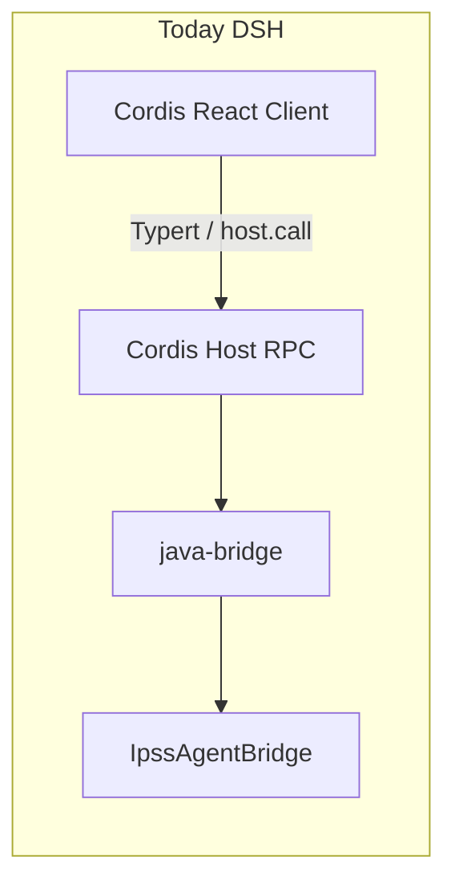
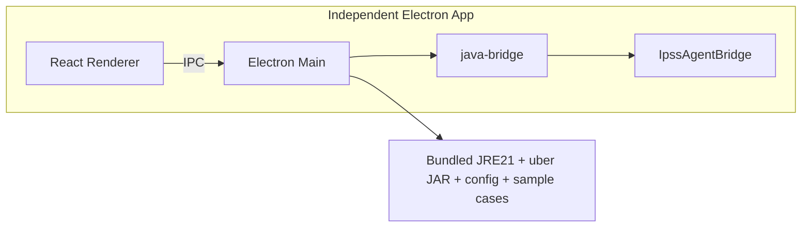

# InterPSS Electron Desktop App Plan

## Current baseline

Today the InterPSS study UI is a **DeepSeek Harness Cordis plugin**:

- Legacy source of truth: [`interpss-dynamic/`](interpss-dynamic/) (host + client bodies)
- Installable package: [`interpss-persistent/`](interpss-persistent/) (`@deepseek-ai/dsh-interpss`)
- Java facade: [`IpssAgentBridge`](src/main/java/org/interpss/agent/bridge/IpssAgentBridge.java) + CLI [`IpssCmd`](src/main/java/org/interpss/agent/IpssCmd.java)
- Node↔JVM: `java-bridge` (docs already note Electron packaging via `isPackagedElectron: true`)



Target:



**Decision locked for this plan:** build a new **self-contained** app under ipss-agent (`interpss-electron/` only—**no `interpss-shared`**), copy/port DSH study UI and Host logic into that tree, reuse Java via the agent uber JAR / `IpssAgentBridge`, and keep MVP feature parity with the DSH InterPSS tab only—no chat/LLM shell in v1. DSH packages stay independent and are not refactored for sharing.

---

## Product scope (MVP = DSH tab parity)

Ship a self-contained desktop study tool that can:

1. Open / select IEEE CDF or PSS/E RAW cases (presets + native file dialog)
2. Run **ACLF**, **CA**, **NERC/ACLF Report**
3. Browse result CSVs (bus/branch/gen/load/contingency) and bus-connection diagram
4. Edit/save ACLF options (`config/aclf_run.json`)
5. Show Markdown report viewer

**Remove** DSH-only constraints: workspace `README.md` must equal `iPSS Agent`, Cordis composition slots, Typert Remote, `@deepseek-ai/dsh-*` deps.

**Defer to later phases:** NERC HTML/Plotly dashboards, PPTX export, MCP/AI chat, DistOPF / 3-phase, alignment with commercial JavaFX `ipss-desktop`.

---

## Architecture

### Package layout (new)

`interpss-electron` owns **all** desktop Host/UI/types code. No shared npm package with DSH. One-time copy from `interpss-dynamic` / `interpss-persistent`, then diverge freely.

```
ipss-agent/
├── interpss-electron/           # NEW independent Electron app (sole desktop package)
│   ├── package.json             # electron + electron-builder
│   ├── electron/
│   │   ├── main.ts              # app lifecycle, IPC, JVM bootstrap
│   │   ├── preload.ts           # contextBridge API
│   │   ├── ipc-contract.ts      # method names + request/response types (app-local)
│   │   └── java/
│   │       └── IpssService.ts   # copied/adapted from persistent Host (Cordis-free)
│   ├── src/                     # React renderer (copied/ported UI, app-local)
│   ├── resources/
│   │   ├── jre/                 # bundled Temurin JRE 21 (per-platform)
│   │   ├── java/                # ipss-agent-cmd-*-uber.jar
│   │   ├── config/              # aclf_run.json, gen_report.json
│   │   └── samples/             # IEEE14/118 (+ optional Texas2K pointer)
│   └── electron-builder.yml
├── interpss-dynamic/            # unchanged DSH prototype (reference only)
└── interpss-persistent/         # unchanged DSH plugin (parallel product)
```

**Independence rule:** do not create `interpss-shared`, do not add cross-package imports between Electron and DSH, and do not refactor DSH to export reusable modules for the desktop app.

### Process model

| Process | Role | Replaces |
|---------|------|----------|
| **Main** | Own workspace root, bootstrap JVM (`ensureJvm` + `isPackagedElectron: true`), call `IpssAgentBridge`, filesystem helpers (`readCsv`, `checkResult*`) | Cordis Host (`lib/index.js`) |
| **Preload** | Expose typed `window.interpss.*` via `contextBridge` | Typert `/api` RPC |
| **Renderer** | React study UI | Cordis `conversation.view` client |

Keep the existing rule from [`docs/js-java-integration.md`](docs/js-java-integration.md): **only paths + JSON/text cross the JS/Java boundary**—no EMF objects in Electron.

### IPC contract (mirror current Host methods)

Reuse the same 14 method surface already used by the plugin (`isActivated` → always true / drop gate; `runAclf`, `runCa`, `runReport`, `loadCase`, `readCsv`, `busConnections`, `getAclfOptions`, `saveAclfOptions`, `summarizeResult`, `getNetworkInfo`, `listCases`, `checkResult`, `checkResultFiles`).

Implement as `ipcMain.handle('interpss:<method>', …)` so renderer code stays close to today’s `host.call('interpss/…')` call sites.

### JVM strategy

1. **Primary:** embed via `java-bridge` pointing classpath at bundled uber JAR (same path as persistent plugin).
2. **Fallback:** `child_process.spawn` of bundled `java -jar … IpssCmd` if JVM embed fails (parity with today’s Host fallback).
3. **Heap:** default `-Xmx4g` (configurable in app settings later).
4. **Crash isolation note:** document that a native/JVM crash can take down Main; phase-2 option is a sidecar Java process over stdio/HTTP if stability becomes an issue.

### Workspace model

Replace DSH session cwd with an explicit **user-chosen project folder** (default: `Documents/InterPSS/` or first-run picker):

- `config/` copied from app resources on first launch
- `data/` / case inputs
- `*/result/` CSV + Markdown outputs (unchanged filesystem contract so skills/HTML generators still work if pointed at the same folder)

---

## Implementation phases

### Phase 1 — Electron skeleton + in-app Host service (3–5 days)

- Scaffold `interpss-electron` with Electron + Vite + React + TypeScript (all code lives under this package).
- Copy Host bootstrap/handlers from [`interpss-persistent/lib/index.js`](interpss-persistent/lib/index.js) into `electron/java/IpssService.ts`; strip Cordis/`ctx.provide`/Typert; define app-local `ipc-contract.ts`.
- Main: window creation, secure preload, workspace root persistence (`electron-store` or app `userData`).
- Wire `java-bridge` with `isPackagedElectron: true`; unpack native binaries outside asar (`asarUnpack` / `extraResources`).
- Prove one round-trip: `loadCase` → `runAclf` → return `networkInfo` + result files for IEEE14.

### Phase 2 — Copy/port study UI into the app (5–8 days)

- Copy case picker, run buttons, options dialog, CSV tabs, bus diagram, Markdown report viewer from the DSH client into `interpss-electron/src/` (not a shared module).
- Replace Typert/`host.call` with `window.interpss.*` IPC.
- Use Electron `dialog.showOpenDialog` for custom case paths.
- Drop activation gate; app is always “activated” when a project folder is set.

### Phase 3 — Packaging & distribution (3–5 days)

- `electron-builder` targets: **macOS arm64/x64** and **Windows x64** first (Linux optional).
- Bundle:
  - Temurin/Eclipse **JRE 21** per platform under `resources/jre`
  - `ipss-agent-cmd-*-uber.jar` (+ verify agent/core/plugin version pin)
  - default `config/` + small sample cases
- Build scripts:
  - `mvn -DskipTests package` (or assemble uber JAR) → copy into `resources/java`
  - `npm run dist` → `.dmg` / `.exe` / `.AppImage`
- Dev mode: use local JDK + `target/ipss-agent-cmd-*-uber.jar` without bundling JRE.
- Smoke checklist: install fresh → open IEEE14 → ACLF → CA → NERC report → reopen results.

### Phase 4 — Hardening (ongoing)

- Progress/cancel UI for long CA runs (Texas2K).
- Structured logging to app log dir; surface Java exceptions cleanly.
- Memory settings UI; large-case guidance.
- CI: unit-test IPC contract mocks; nightly packaged smoke on one platform.
- Leave `interpss-dynamic` / `interpss-persistent` as a separate DSH product (no shared-code maintenance burden).

---

## Key reuse vs rewrite

| Keep as-is | Copy into Electron (then own) | Rewrite / drop |
|------------|-------------------------------|----------------|
| `IpssAgentBridge`, runners, report generators, uber JAR | Host service → app-local `IpssService.ts` | Cordis composition, Typert Remote, DSH activation gate |
| Result CSV/Markdown layout under `wspace` | Workspace root = user project folder | `dsh.bundle` / `cordis.patch.yml` |
| React study UX patterns (as reference) | Vite React app + Electron IPC under `src/` | Dependency on `@deepseek-ai/dsh-*`; any `interpss-shared` package |
| `java-bridge` embed pattern | `isPackagedElectron` + asarUnpack + bundled JRE | Shell-only Host as primary path |

---

## Risks and mitigations

- **Native binary packaging (`java-bridge`):** follow existing doc; unpack natives; test signed macOS builds early.
- **Uber JAR size / version drift:** pin one agent+core+plugin stack before first public build; script resource copy in CI.
- **Large cases (Texas2K):** keep `-Xmx4g` default; consider out-of-process Java sidecar if Main OOMs/crashes.
- **UI source is large single `client.js`:** copy incrementally into `interpss-electron/src/` (shell + ACLF first, then CA/report tabs) rather than a big-bang rewrite or shared extraction.
- **Do not conflate with `ipss-desktop` (JavaFX):** this Electron app is the DSH-study-workflow product; commercial desktop remains separate unless a later unification project is scoped.
- **Drift vs DSH:** without a shared package, Electron and DSH will diverge; accept that—desktop independence is the goal.

---

## Success criteria

- Double-clickable InterPSS app on macOS/Windows with **no DeepSeek Harness install**.
- IEEE14 end-to-end: Load → ACLF → CA → Report without external JDK (bundled JRE).
- Same CSV/Markdown artifacts as today’s CLI/DSH under the chosen project folder.
- `interpss-electron` has **zero** runtime/build dependency on `interpss-dynamic` / `interpss-persistent` / any shared UI package.
- DSH plugin continues to work unchanged for Harness users (parallel track).
