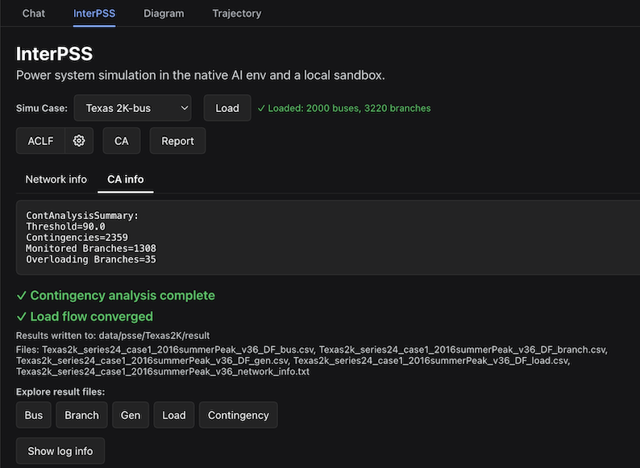
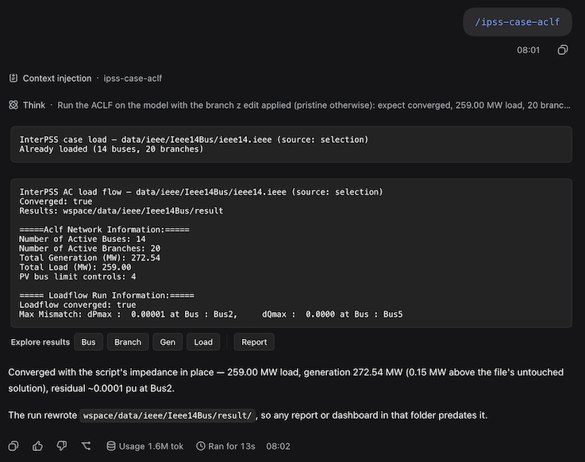
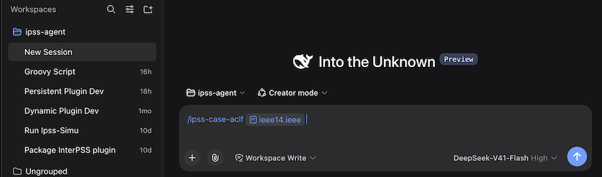

# InterPSS DSH Plugin User Guide

## Overview

The InterPSS DSH Plugin adds an **InterPSS** tab to the DeepSeek Harness GUI. Use it to:

- Load IEEE CDF (`.ieee`) or PSS/E RAW (`.raw` / `.RAW`) cases
- Run AC load flow (ACLF) and DC contingency analysis (CA)
- Explore bus / branch / gen / load / contingency result CSVs
- Inspect bus connection relationships (diagram and tables)
- Generate an **AC Loadflow Report** or a **NERC TPL-001-5** report



You can also use natural-language runs in the Chat tab to interact with the current in-memory simulation case.



For natural-language runs against the **in-memory** case (Chat tools), see [InterPSS DSH Chat](#interpss-dsh-chat) below. For batch CLI-style runs (`/ipss-sim`), see the [batch chat user guide](batch_chat_user_guide.md).

### Prerequisites

- DeepSeek Harness with the InterPSS plugin installed — see [InstallDSHPlugin.md](../../InstallDSHPlugin.md)
- An **iPSS Agent** workspace with:
  - **Java JDK 21** on `PATH`
  - Built CLI: `target/ipss-agent-cmd-1.0.0-uber.jar` (`./mvnw -q clean package`; see [Setup.md](../../Setup.md))
  - Case files under `wspace/data/**`
  - ACLF options file: `config/aclf_run.json`


### Activation gate

The InterPSS tab only enables its tools when the workspace `README.md` first `#` heading is exactly `iPSS Agent`. Otherwise the tab shows:

> InterPSS is not available in this workspace. Please install iPSS Agent from GitHub first

---


## InterPSS DSH GUI Tab

Open the iPSS Agent folder as a workspace in DSH. Create a new chat session under the workspace, select the Creater mode (recommended), prompt the following ipss-case-aclf command to run a sample AC Loadflow:

```text
/ipss-case-aclf @<ieee14.ieee>
```



You can then run the power system simulation workflow or chat following the procedures below.

### Open the InterPSS tab

1. After installing or updating the plugin, restart `dsh web` and hard-reload the browser page.
2. In the conversation view, open the **InterPSS** tab (next to Chat).
3. The last **Simu Case** selection is remembered when you switch away and back.

---

### Open the Diagram tab

The tab bar reads **Chat · InterPSS · Diagram · Trajectory**. The **Diagram** tab draws the
one-line diagram of whichever case the InterPSS tab has selected, full-size. (Plugin 0.6.8 added
the tab; 0.6.9 removed the InterPSS tab's **Diagram** button, which used to open the same picture
in a dialog — the InterPSS action row is now **ACLF · ⚙ · CA · Report**; 0.6.10 dropped the tab's
own heading and subtitle, so it opens straight onto the **Simu Case** row and the drawing gets the
space; 0.6.11 dropped the `Scroll to zoom · drag to pan` hint, leaving the toolbar as controls:
**Rendered · Source · − · 100% · + · Fit**; 0.6.12 added the draw.io button at its end.)

1. Select a case in the **InterPSS** tab (a preset or a custom path); the Diagram tab follows.
2. Switch to **Diagram**. It reads that case's `diagram/` folder:
  - one `.drawio` file — opened straight away;
  - several — a picker to switch between them, reopening the one you last viewed;
  - none — it says so; a case gets a diagram when you run the one-line diagram skill
    (/ipss-case-diagram), which writes `<case>/diagram/`.
3. Interact with the drawing:
  - **hover** a bus bar (or its `Bus-N` label) or a branch for the same tooltip the InterPSS
    connection diagram shows; without a converged result it says `no result data — run ACLF`;
  - **scroll** to zoom about the cursor, **drag** to pan, **Fit** to reset;
  - **Source** shows the raw draw.io XML.
4. To change the diagram itself, click the **draw.io button at the right end of the top row** (the
   tab's upper-right corner, 0.6.15+): it opens the file in the local draw.io desktop app
   (`open -a draw.io` on macOS), so you can edit and save it there. The tab prints
   `Launched draw.io (open -a draw.io)` to the button's left, or the Host's reason if it could
   not. (The button arrived in 0.6.12; a Host change like this one takes effect only after the
   app is restarted.)
5. Loading another case from chat (`interpss_case_load`) moves the Diagram tab with it — it
   always draws the current simulation case, so the two tabs cannot disagree.

---


### Load a simulation case

InterPSS DSH Plugin uses an In-Memory Computing (IMC) approach. When a simulation case is loaded, the loaded InterPSS simulation model will stay in memory, available for the simulation runs until another simulation case is loaded or the DSH runtime is shutdown. Therefore, ACLF and CA buttons stay disabled until a case is loaded into the simulation model. The same in-memory model is what DSH Chat tools use; a Chat load also updates this tab’s **Simu Case** picker and Loaded indicator (plugin 0.3.19+).

1. Choose a case from **Simu Case**:
  - **IEEE 118-bus** — `data/ieee/Ieee118Bus/ieee118.ieee`
  - **IEEE 14-bus** — `data/ieee/Ieee14Bus/ieee14.ieee`
  - **Texas 2K-bus** — PSS/E RAW under `data/psse/Texas2K/`
  - **Select…** — custom case
2. For a custom case:
  - Set format to **IEEE CDF** or **PSS/E RAW**.
  - Enter a path relative to the workspace (for example `data/ieee/Ieee118Bus/ieee118.ieee`), or click the search icon to open the case picker.
  - The picker lists matching files under `wspace/data`, filtered by the selected format.
3. Click **Load**.
  - Success: `✓ Loaded: N buses, M branches`, plus a **Network info** panel.
  - Failure: `⚠` with an error message.


#### Prior results on case change

When you select a case that already has a converged result (`*_network_info.txt` and result CSVs under the case’s `result/` folder), the tab can show that prior ACLF output without re-running. Use **ACLF** again when you want a fresh solve.

---


### Perform AC Load Flow Analysis

1. Load a case (see above).
2. Optionally open **AC Loadflow options** (gear next to **ACLF**) and save settings.
3. Click **ACLF**.

On success:

- `✓ Load flow converged`
- Result directory and file list
- **Explore result files** buttons: Bus, Branch, Gen, Load
- **Show log info** / **Hide log info** for stdout/stderr (not shown for auto-loaded prior results)

On failure, the tab shows `✗ Load flow failed` with error and log output.

#### Result files

Results are written under `wspace/<case-parent>/result/`:


| File                      | Contents                              |
| ------------------------- | ------------------------------------- |
| `<stem>_DF_bus.csv`       | Bus voltages and related quantities   |
| `<stem>_DF_branch.csv`    | Branch flows / loadings               |
| `<stem>_DF_gen.csv`       | Generator results                     |
| `<stem>_DF_load.csv`      | Load results                          |
| `<stem>_network_info.txt` | Network summary used for auto-display |


`<stem>` is derived from the case file name (without extension).

---


### AC Loadflow Options

Click the gear button next to **ACLF** (enabled after **Load**). The dialog title is **Run AC Loadflow**. Changes apply to later ACLF runs after you click **Save**.

**Where options are stored:**

- **Save** writes the case-folder file `wspace/<case-parent>/config/aclf_run.json`.
- ACLF runs prefer that case-folder file when it exists; otherwise they use the project default `config/aclf_run.json`.
- Chat ACLF (`interpss_run_aclf`) uses the same two-tier rule.

Three tabs:

#### Main

- **Loadflow Method** — NR, PQ, or GS
- **Coordinate** — Polar or XY
- **Tolerance** and unit (PU / MVA)
- **Max Iterations** and **Non-Divergent**
- **Low Load Volt Adjust**, with **ConstP Vmin** / **ConstI Vmin** when enabled
- Helpers: **Apply PV Gen QLimit In Init**, **Turn Off Island Bus**, **Auto Set Zero-Z Branch**, **Auto Turn Line to Xformer**
- **Include Adjustments/Controls** — master switch for limit / voltage / power adjustment checkboxes on this tab; also enables the **Adj/Ctrl Setting** tab

When Include Adjustments is on, you can toggle:

- Limit control (PV/PQ bus limits, backoff check)
- Voltage adjustment (remote Q, xfr tap, switched shunt, SVC, HVDC tap, discrete adjust)
- Power adjustment (PS-xfr P control)


#### NR Config

- **Optimize Algorithm**
- **Variable Update Limit**, delta voltage angle/magnitude limits
- **Stop No Solution Found**, **Min Scale Factor**


#### Adj/Ctrl Setting

Available only when **Include Adjustments/Controls** is checked. Groups:

- **Limit Ctrl** — start point, error factor, apply type
- **Voltage Adj** — start point, tolerance (PU), apply type, dQ/dV threshold
- **Power Adj** — start point, error factor, apply type
- **Acceleration Factors** — PV/PQ limit, remote Q, SVC, xfr tap, PS-xfr

Use **Close** to dismiss without saving, or **Save** to persist options.

---


### Explore Results

After a successful ACLF (or when prior results are shown), use **Explore result files**.

Tables support sticky headers and infinite scroll (`Showing N of M rows` until all rows are loaded).

#### Bus Results

1. Click **Bus** to open the bus CSV table.
2. Click a row to select a bus (shown as **Selected bus: …**).
3. Right-click a bus row → **Connection info** to open the connection popup.
4. In Gen or Load tables, double-click a bus ID cell to select that bus.


#### Branch / Gen / Load Results

Click **Branch**, **Gen**, or **Load** to view the corresponding CSV. Numeric columns are formatted for readability where applicable.

#### Contingency Results

The **Contingency** explorer button appears after a successful **CA** run in the current session (see below). It opens the contingency result CSV.

#### Bus connection relationships

From the bus table context menu (**Connection info**), or by navigating from Gen/Load bus IDs:

1. A popup titled `<busId> — branch connections` opens.
2. Switch views:
  - **Diagram** — connected buses and branches; hover for tooltips; transformers styled distinctly; double-click a node to select or navigate to that bus
  - **Branch** — connection table
  - **Gen** / **Load** — equipment at the selected bus (or a short empty-state message)
3. A count label shows connections, generators, or loads for the active view.

---


### Perform Contingency Analysis

1. **Load** the case.
2. Click **CA**. This opens the **Run Contingency Analysis** dialog (it does not start the run immediately).


#### Run Contingency Analysis dialog

The dialog shows the **Over Loading Threshold(%)** field at the top, then the two sections. Each
section can use a built-in default or a user-defined `.json` from the case folder:


| Field / Section                 | Default                        | Custom                                                                                                                  |
| ------------------------------- | ------------------------------ | ----------------------------------------------------------------------------------------------------------------------- |
| **Over Loading Threshold(%)**   | `90`                           | Any percentage `0 < t <= 1000` — a branch whose post-contingency loading reaches it is reported as an overload (0.4.6+) |
| **Define Contingency Branches** | Consider all N-1 contingencies | User-defined contingency — pick a `.json` with a `contingencies` array                                                  |
| **Define Monitored Branches**   | Monitor all branches           | Monitor selected branches — pick a `.json` with a `monitored_branches` array                                            |


For a custom pick:

- Click the search icon next to the custom radio, then choose a `.json` in the case folder.
- A green line shows the entry count (for example `User-defined contingencies: 2359 (…json)`).
- Invalid or missing shape shows a red error; **OK** stays blocked until custom picks are valid.

**Starting values:** if the case folder already has `config/ca_run.json`, the dialog loads it (including `overloadThreshold`; a file without that key — or no file at all — starts at `90`). Otherwise it suggests companion files by name (filenames containing `contingenc` / `monitor`) when present.

An out-of-range threshold blocks **OK** with `over loading threshold must be a percentage between 0 and 1000`.


| Button         | Effect                                                                                                                                         |
| -------------- | ---------------------------------------------------------------------------------------------------------------------------------------------- |
| **OK**         | Saves `wspace/<case-parent>/config/ca_run.json` — the over loading threshold and both section choices (0.4.7+), closes the dialog, and runs CA |
| **Cancel** / ✕ | Closes without writing or running                                                                                                              |


`config/ca_run.json` is the same file the Java CLI reads for CA, so GUI and batch runs stay aligned.

On success:

- `✓ Contingency analysis complete`
- Contingency result file name (typically `<stem>_DF_contingency.csv`)
- A **Contingency** button to open that CSV in the explorer

CA requires a loaded case. You can run CA after Load even if you have not clicked **ACLF** in this session; contingency CSV exploration for the new CA run appears once CA succeeds.

---


### Generate Reports

1. Ensure result CSVs exist (run **ACLF**, and **CA** if you need a NERC-style report).
2. Click **Report** when it is enabled (the tab checks that result files are available).

Report type is chosen automatically:


| Condition                                 | Report                                                 |
| ----------------------------------------- | ------------------------------------------------------ |
| Contingency CSV present in the result dir | **NERC TPL-001-5 Report** → `NERC_TPL_001_5_Report.md` |
| Otherwise                                 | **AC Loadflow Report** → `AC_Loadflow_Report.md`       |


In the report dialog:

- Wait for **Generating report…** if needed
- Toggle **Rendered** (formatted Markdown) or **Source** (raw Markdown)
- Close with ✕

---


## InterPSS DSH Chat

The Chat tab can drive the same in-memory simulation case as the InterPSS tab. The DSH plugin registers model **tools** so the agent can load a selected InterPSS case, show network info, run ACLF, summarize results, and apply Groovy what-if scripts — without leaving the conversation.

Chat and the InterPSS tab share one embedded bridge: a case loaded (or solved) in either place stays in memory until another case is loaded or the DSH runtime shuts down.

**Tab stays in sync with Chat loads (plugin 0.3.19+).** When a Chat tool loads or switches cases, the InterPSS tab’s **Simu Case** picker follows that case, shows `✓ Loaded: N buses, M branches`, and refills the network-info panel — the same confirmation as the tab’s own **Load** button. Switching between Chat and the tab keeps that indicator (0.3.23+).

For the full tool contract (inputs, cards, version history), see [interpss-tools.md](../interpss-tools.md). For batch runs through the Java CLI (`/ipss-sim`), see the [batch chat user guide](batch_chat_user_guide.md).

### Before you start

1. Open an **iPSS Agent** workspace (same activation gate as the InterPSS tab).
2. Optionally select a case in the **InterPSS** tab — Chat tools use that selection when you do not name a case.
3. Prefer an explicit load first (or ask the agent to load), then ask for info, ACLF, summary, or a script.


### What you can ask


| Goal                              | Example prompt                                                   | Skill / tool                                   |
| --------------------------------- | ---------------------------------------------------------------- | ---------------------------------------------- |
| Load the selected (or named) case | `Load the IEEE 118-bus case` / `Load the selected InterPSS case` | `$ipss-case-load` / `interpss_case_load`       |
| Network info                      | `Show network info for the current case`                         | `$ipss-case-info` / `interpss_network_info`    |
| Run AC load flow                  | `Run ACLF on the selected case`                                  | `$ipss-case-aclf` / `interpss_run_aclf`        |
| Adjust load Q to a voltage band   | `Adjust Bus14 load Q to bring it into [0.89, 0.90] pu`           | `$ipss-case-aclf-adjust` / `interpss_run_gvy` + `interpss_run_aclf` |
| Case summary / top-N              | `Summarize the current case` / `Find the lowest voltage buses`   | `$ipss-case-summary` / `interpss_case_summary` |
| What-if scenario script           | `Run ieee14_adjBus14.gvy on IEEE 14-bus, then solve`             | `$ipss-case-script` / `interpss_run_gvy`       |
| One-line diagram for the case     | `Draw the one-line diagram for the current case`                 | `$ipss-case-diagram` (script)                  |


Slash / skill forms: `$ipss-case-load`, `$ipss-case-info`, `$ipss-case-aclf`, `$ipss-case-aclf-adjust`, `$ipss-case-summary`, `$ipss-case-script`, `$ipss-case-diagram`. Plain natural language works the same when the agent picks those tools.

### Case selection

When you do not name a case, tools resolve in this order:

1. The `case` argument in the tool call (if the agent passed one)
2. The case currently selected in the InterPSS tab
3. The case already held in the embedded bridge

You can name a case as:


| Form                       | Example                                       |
| -------------------------- | --------------------------------------------- |
| Workspace-relative path    | `data/ieee/Ieee118Bus/ieee118.ieee`           |
| Path with `wspace/` prefix | `wspace/data/ieee/Ieee14Bus/ieee14.ieee`      |
| Preset label               | `IEEE 118-bus`, `IEEE 14-bus`, `Texas 2K-bus` |


`interpss_case_load` is a **no-op** (`alreadyLoaded: true`) when the bridge already holds that exact case — it does not re-parse. To force a re-parse of the same case, use the tab’s **Load** button (or `reload: true` on a script run).

### Typical workflows


#### Load → network info → ACLF

```text
Load IEEE 118-bus and show network info
Run ACLF on the selected case
```

After a successful ACLF in Chat, the tool card can show **Explore results** (Bus / Branch / Gen / Load) and a **Report** button for the AC Loadflow Markdown report — similar to the InterPSS tab explorers. That Chat **Report** always generates the AC Loadflow report (`reportType: aclf`), even if a contingency CSV also exists; use the InterPSS tab **Report** button when you want the contingency-based auto pick (NERC vs ACLF).

#### Summary and rankings

```text
Summarize the current case
Find the 10 lowest voltage buses
Find the largest generation / loads / branch flows
```

Notes:

- Summary reads the **in-memory** model. For solved values, run ACLF first.
- Branch ranking is by flow **magnitude**, not rating loading. For `Loading%`, ask about the branch result CSV (or use the tab explorer).
- Successful summary calls show **no tool card** by design — the agent’s chat reply is the summary.


#### What-if with a Groovy script

Scripts live under the case folder’s `scripts/` directory (for example `data/ieee/Ieee14Bus/scripts/`). The script **edits** the held model in place and does not solve; run ACLF afterward when you need solved results.

```text
On IEEE 14-bus, run ieee14_adjBus14.gvy, then run ACLF
```

Important:

- Edits are **not** rolled back. To reset, ask to reload the case (`reload: true` on the script tool) or load another case and come back.
- Running the same relative change twice applies it twice unless the script sets absolute values.
- Loading a **different** case replaces the held model — any prior ACLF solution or script edits on the old case are gone.
- Only run scripts you trust.

To size load-Q changes from `dV/dQ` and move bus voltages into a band (IEEE14 Bus14 / Bus13 examples), see [loadflow-adjustment-user-guide.md](loadflow-adjustment-user-guide.md).


### Chat vs InterPSS tab vs batch Chat


|                           | InterPSS tab               | DSH Chat (this section)                                            | Batch Chat (`/ipss-sim`)             |
| ------------------------- | -------------------------- | ------------------------------------------------------------------ | ------------------------------------ |
| Model                     | In-memory bridge           | Same in-memory bridge                                              | Separate Java CLI process            |
| Load                      | **Load** always re-parses  | Tools reuse the held case when possible; picker mirrors the bridge | Fresh process per run                |
| ACLF / explorers / report | Buttons and dialogs        | Tools + ACLF card (ACLF report only)                               | CLI writes files under `result/`     |
| Contingency (CA) / NERC   | **CA** dialog + **Report** | Not via Chat tools today — use the tab or `/ipss-sim`              | Full ACLF + CA + NERC workflow       |
| What-if scripts           | —                          | `interpss_run_gvy` / `$ipss-case-script`                           | Edit case files or use CLI workflows |


### Tips

- Prefer naming the case when the tab selection might be stale (`source` in the tool result tells you: `argument`, `selection`, or `bridge`).
- ACLF options still come from the case-folder `config/aclf_run.json` when present, otherwise `config/aclf_run.json` (same as the tab gear dialog).
- Large PSS/E cases (for example Texas 2K) can take minutes in Chat ACLF — wait for the tool card to settle.
- If a tool says the bridge is unavailable, rebuild the uber JAR and restart `dsh web` (see [Setup.md](../../Setup.md) / `scripts/setup-java-bridge.sh`).
- Very large cases need enough JVM heap; the plugin bridge uses `-Xmx8g` (0.3.20+).


## Tips and troubleshooting


| Symptom                                        | What to check                                                                                                            |
| ---------------------------------------------- | ------------------------------------------------------------------------------------------------------------------------ |
| “InterPSS is not available in this workspace…” | Workspace `README.md` first H1 must be exactly `iPSS Agent`.                                                             |
| **ACLF** / **CA** greyed out                   | Click **Load** successfully first.                                                                                       |
| Case picker empty                              | No matching `.ieee` or `.raw`/`.RAW` under `wspace/data` for the selected format.                                        |
| CA dialog custom pick errors                   | Pick a case-folder `.json` with a `contingencies` or `monitored_branches` array; check the green count / red error line. |
| Tab picker shows a different case than Chat    | Update the plugin to 0.3.19+ (picker mirrors the bridge), or pass `case` explicitly in Chat.                             |
| **Report** greyed out                          | No converged result CSVs yet — run ACLF (and CA for NERC).                                                               |
| Gear disabled                                  | Load a case first.                                                                                                       |
| Adj/Ctrl Setting tab disabled                  | Enable **Include Adjustments/Controls** on the Main options tab.                                                         |
| Chat load did not re-parse the same case       | Expected — use the tab **Load** button to force a re-parse.                                                              |


### Related

- InterPSS DSH Chat tools (developer reference) — [interpss-tools.md](../interpss-tools.md)
- Batch Chat / `/ipss-sim` — [batch_chat_user_guide.md](batch_chat_user_guide.md)
- Interactive HTML dashboards and NERC slide decks — see the README Reference table (nerc-report-html / nerc-report-slides skills)
- Install or update the plugin — [InstallDSHPlugin.md](../../InstallDSHPlugin.md)

