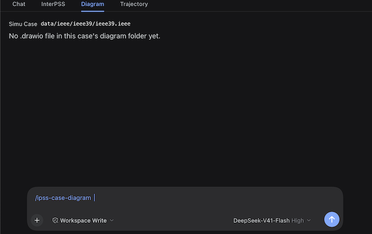

# InterPSS One-Line Diagram User Guide

View and generate **one-line diagrams** for the current InterPSS simulation case in DeepSeek Harness: the **Diagram** tab previews `.drawio` files under the case’s `diagram/` folder; Chat (or the generator script) creates those files from ACLF result CSVs.


This guide is the practical how-to for the DSH plugin. For the InterPSS tab and Chat overview, see [dsh_plugin_user_guide.md](dsh_plugin_user_guide.md). For generator layout rules and the draw.io MCP round-trip, see [oneline-diagram-process.md](../oneline-diagram-process.md). The generate path is packaged as `$ipss-case-diagram`.

---


## When to use this


| Situation | Approach |
| --------- | -------- |
| Case already has a `.drawio` under `diagram/` | Open the **Diagram** tab and inspect / zoom / edit |
| Case has ACLF results but no diagram yet | Ask Chat to draw it (`$ipss-case-diagram`), or run the generator script |
| Layout looks wrong after generation | Re-run with another `--seed`, or open the file in draw.io and edit |
| You need the authoritative PNG | Use the Diagram tab’s draw.io button (desktop app), not only the Pillow preview |
| You are comparing the preview with the draw.io app | Geometry and styles match since **0.6.33** (square bars, label alignment, label masks). These differences are deliberate: near-grey colours become theme tokens (dark mode), flagged buses/branches take the flag colours, a search hit turns **green** (`#2EA043`, **0.6.36+** / **0.7.0**), a filter hides what does not match, and the hover areas are padded |
| You want to find a bus or branch on a large drawing | Use **🔍 Search** (`Bus-N`, number, name, or `Bus-A -> Bus-B`); **OK** centres the view on the hit (**0.6.37+** / **0.7.0**) |


---


## Prerequisites

- DeepSeek Harness with the InterPSS plugin installed — recommend **0.7.0+** (Diagram tab since **0.6.8**; draw.io button **0.6.12+**, configurable launcher **0.6.16+**; search / filter / gear / birdseye / loadings through **0.6.37**, packaged as the **0.7.0** line) — see [InstallDSHPlugin.md](../../InstallDSHPlugin.md)
- An **iPSS Agent** workspace (same activation gate as the InterPSS tab)
- A selected / loaded simulation case under `wspace/data/**`
- For **generation**: converged ACLF outputs `<case>/result/<stem>_DF_bus.csv` and `_DF_branch.csv` (run ACLF first if missing)
- Optional: the local **draw.io** desktop app to edit from the Diagram tab. Which executable is launched comes from [`config/ipss_plugin_env.json`](../../config/ipss_plugin_env.json) — `open -a draw.io` on macOS by default, with a Windows and a Linux path shipped as well (see [Configure the draw.io launcher](#configure-the-drawio-launcher-0616))

---


## Diagram tab (view and interact)

The tab bar reads **Chat · InterPSS · Diagram · Trajectory**. The **Diagram** tab draws the one-line diagram of whichever case the InterPSS tab has selected.



### Open and load

1. Select a case in the **InterPSS** tab (preset or custom path); the Diagram tab follows that selection.
2. Switch to **Diagram**. It reads that case’s `diagram/` folder:
   - **one** `.drawio` — opened straight away;
   - **several** — a picker to switch between them (remembers the last one you viewed);
   - **none** — the tab says so; generate a diagram first (see [Generate a one-line diagram](#generate-a-one-line-diagram)).
3. Loading another case from Chat (`interpss_case_load`) moves the Diagram tab with it — it always draws the **current** simulation case, so the two tabs cannot disagree.

### Toolbar and interaction

Toolbar (plugin **0.6.11+**, zoom picker **0.6.21+**, Fit in the picker **0.6.22+**, search + filter **0.6.23+**, one view only **0.6.34+**): **− · [level ▾] · + · 🔍 · ▼**, plus the **draw.io** button and the **gear** (config options, **0.6.26+**) in the tab’s upper-right corner (**0.6.12+**). The drawing is always the rendered scene — the old `R` / `S` toggle and its raw-XML Source view were removed in **0.6.34**. The middle control is a **zoom picker**: it shows the current level and sets it from **25 / 50 / 75 / 100 / 125 / 150 / 200 / 300 / 400 %**, about the centre of what you are looking at. A level you reached with the wheel (say 745 %) is listed too and shown as the selection, so you can always come back to it.

| Action | Effect |
| ------ | ------ |
| **hover** a bus bar (or its `Bus-N` label) or a branch | Same tooltip style as the InterPSS connection diagram; without a converged result: `no result data — run ACLF`. A branch adds its flow loadings (**0.6.30+**): `Basecase Loading(%): 13.4%` from the branch table, and `Contingency Loading(%): …` when the CA result table lists that branch — that table holds only branches at or above the CA's `overloadThreshold` (the case's `config/ca_run.json`, 90 % by default), so lower-loaded branches have no contingency line. Lower the threshold and re-run CA to see more (**0.6.31+** lists the table even when it holds few rows) |
| **scroll** / **drag** | Zoom about the cursor / pan |
| **🔍 Search the diagram** (**0.6.23+**, `->` since **0.6.25**, `Bus-1 -> Bus-2` since **0.6.35**, green highlight since **0.6.36**, centred on OK since **0.6.37**) | Opens a dialog (OK / Cancel): a bus number (`1001`), a bus id (`Bus-1001`), part of a bus name (`ODESSA`), or a branch written as `1001->1002` or between two ids (`Bus-1 -> Bus-2` — the id spelling, spaces around the arrow and the ids' hyphens all optional). The placeholder and help describe *this* case — its bus count and range, a branch example from its own bus ids, and a name from its own table. Matches are highlighted in **green** in the drawing (bus bar, its `Bus-N` text and the branch line) and counted next to the buttons; **OK** also brings the match to the middle of the view at the zoom you are already at (at **Fit** the whole drawing is visible, so nothing moves — zoom in first if you want the jump); **Cancel** changes nothing |
| **▼ Filter the diagram** (**0.6.23+**, live message **0.6.24+**, band wording from the config **0.6.27+**, branch loading filters **0.6.32+**) | Opens a dialog (OK / Cancel) that keeps one **area** and/or **zone** (from the case's own bus table) and/or only the buses outside the band `config/net_diagram.json` sets (0.9–1.1 pu by default), and/or only the branches at or above a flow flag (**0.6.32+**) — base-case and/or contingency, each labelled with the threshold from that same config. Its message previews your selection live — `Showing 91 of 2000 buses (area 7 COAST, zone 1 BAY CITY).` — while the drawing itself changes only on **OK**. Everything that does not match is hidden, with its branches and transformer symbols; a branch-loading criterion also hides the buses that are not an end of a branch that stays, and the message then counts **branches** (`Showing 144 of 2000 buses and 86 of 2678 branches (base-case loading ≥ 70%).`). A loading box is disabled while its result table is missing (`no branch table yet` / `no CA table yet`). The funnel stays lit while a filter is on, and the status text (`filter: area 5 ✕`) clears it |
| **⚙ config options** (**0.6.26+**) | Opens the settings — bus limit/colour, base-case branch flow %/colour, contingency branch flow %/colour, and **Show the birdseye view** (**0.6.29+**) — and writes [`config/net_diagram.json`](../../config/net_diagram.json) on **OK** (**Cancel** changes nothing). The flags are what colours the drawing: buses outside the band in `Bus_flag_color`, branches at or above a flow percent in their colour. A **flags:** summary next to the toolbar shows how many of each, and clicking it reopens this dialog. The `.drawio` file itself keeps no colour, so the desktop app and the PNG stay plain |
| **the birdseye** (**0.6.28+**, switch **0.6.29+**) | The thumbnail in the canvas's bottom-right corner shows the whole drawing with the part you are looking at outlined. Turn it off with **Show the birdseye view** in the gear dialog (the setting lives in `config/net_diagram.json`). **Click or drag inside it** to move the view there; it is handy the moment you zoom past fit on a large case |
| **the level ▾ picker** (**0.6.21+**, Fit since **0.6.22+**) | Pick a zoom percentage (25–400 %) and the view zooms about its centre, or pick **Fit** (the list’s last entry) to show the whole page — while fitted the control reads `Fit`. The list also carries whatever level the wheel reached, selected. There is no separate Fit button |
| **a red bar + red `Bus-N`** (**0.6.18+**) | That bus's solved voltage magnitude is outside the band in `config/net_diagram.json` (default **0.9–1.1 pu**, checked strictly: the endpoints themselves are in band). Hover it for the out-of-band warning. Needs the case's ACLF result tables; a case with no results, or every bus in band, simply shows no red. **The `.drawio` file is not modified** — the colour is chosen when the tab renders the SVG, so the file, the desktop draw.io app and the generator's PNG preview stay exactly as generated |
| **draw.io** button (upper-right, **0.6.15+**) | Opens the current file in the local draw.io desktop app, using the launcher configured in `config/ipss_plugin_env.json` (**0.6.16+**; `open -a draw.io` on macOS by default). Status text appears to the left of the button (`Launched draw.io…` or the Host error). Restart `dsh web` after a Host change so the button works. |

(Plugin history in brief: **0.6.8** added the tab; **0.6.9** removed the InterPSS-tab Diagram modal; **0.6.12** / **0.6.15** / **0.6.16** draw.io button and launcher config; **0.6.18+** voltage / flow flags; **0.6.21–0.6.32** zoom picker, search/filter, gear, birdseye, branch loadings; **0.6.34** removed the `R` / `S` Source view; **0.6.35–0.6.37** bus-id branch search, green highlight, centre-on-OK; **0.7.0** packages that Diagram line — no further UI change.)

### Configure the draw.io launcher (0.6.16+)

The button does not hard-code a desktop app: it reads an ordered launcher list from the project’s
[`config/ipss_plugin_env.json`](../../config/ipss_plugin_env.json) (beside `config/aclf_run.json`),
so the same plugin serves macOS, Windows and Linux. The shipped file already names a draw.io
executable for each OS:

| Platform | Shipped launchers (in order) |
| -------- | ---------------------------- |
| macOS | `open -a draw.io` → `/Applications/draw.io.app/Contents/MacOS/draw.io` |
| Windows | `C:\Program Files\draw.io\draw.io.exe` → `cmd.exe /c start ""` |
| Linux | `drawio` → `/opt/drawio/drawio` → `xdg-open` |
| any | untagged `open` / `xdg-open`, tried last as file-association fallbacks |

- `exe` is the executable (a bare name is looked up on `PATH`, or give an absolute path such as
  `D:\Apps\draw.io\draw.io.exe`), `args` are prepended before the file path, `label` is what the
  status text reports, and the optional `platform` tag (`darwin` / `win32` / `linux`; `macos`,
  `windows` and `posix` are accepted) limits an entry to one OS.
- Entries for **this** machine’s platform are tried first, then the untagged ones; entries for
  another OS are skipped, so one committed file works everywhere. **Put your own install at the
  top** of the list if it lives somewhere unusual.
- Every entry resolves its executable before it is spawned, so a path that is not installed is
  skipped with a message rather than failing the click, and all the failures are reported together
  in the button’s error.
- A missing file is fine (the built-in defaults are exactly the shipped list). A file that exists
  but is malformed falls back to those defaults and says so in the error text, so a typo does not
  look like a broken button.
- Changing the file needs no plugin restart — it is read per click (only the 0.6.16 **code** needs
  one app restart to arrive).

---


## Generate a one-line diagram

Diagrams are **generated, not hand-placed**, for cases larger than a small teaching example. The generator (`wspace/script/gen_oneline_diagram.py`) lays out buses and branches from ACLF CSVs in the style of `wspace/template/oneline-diagram.drawio`, then writes:

- `<case>/diagram/<stem>-oneline.drawio` — what the Diagram tab opens
- `<stem>-oneline-preview.png` — optional Pillow preview (approximate)

### From Chat (recommended)

With the case selected (or named) and ACLF results present:

```text
Draw the one-line diagram for the current case
```

or:

```text
/ipss-case-diagram
```

The agent runs `$ipss-case-diagram`, which resolves the case folder, checks for `*_DF_bus.csv` / `*_DF_branch.csv`, runs the generator, and reports the `.drawio` path. Switch to the **Diagram** tab to view it.

If results are missing first:

```text
Run ACLF on the selected case, then draw the one-line diagram
```

### From the shell

Use the harness Python that has **numpy** and **Pillow** (a bare system `python3` often lacks Pillow):

```bash
PY="${DSH_PYTHON:-$HOME/.dsh/dsh-runtimes/dsh-primary-runtime/dependencies/python/bin/python3}"

"$PY" wspace/script/gen_oneline_diagram.py wspace/data/ieee/Ieee118Bus \
    --title "IEEE 118-Bus One-Line Diagram"
```

Useful flags:

| Flag | Detail |
| ---- | ------ |
| `--title TEXT` | Page title and diagram name |
| `--layout auto\|force\|lattice` | Placement strategy. `auto` (default) uses the force pipeline up to **250 buses** and the lattice above it; `lattice` puts every bus on its own grid cell (the only path that can place a large case — Texas 2K, 2000 buses, produces an 8000 × 6000 page in ~18 s); `force` always uses the original pipeline |
| `--seed N` | Another valid layout for the same topology (default `11`) |
| `--no-png` | Skip the Pillow preview |
| `--check FILE` | Validate an existing diagram; write nothing |
| `--open` | After a passing self-check, open in the draw.io editor (MCP) |

A non-zero exit means the self-check failed (ids, transformers, Bus-1 corner rule, etc.).

### What gets drawn


| Element | Detail |
| ------- | ------ |
| Buses | Vertical bar per bus with `Bus-N` label above |
| Branches | One undirected line per branch row; parallel circuits slightly apart |
| Transformers | Two interlocking rings on `IsXfmr` branches |
| Loads / generators / voltage colours | Not drawn — topology only |
| Header | Title, subtitle (counts / voltage levels when available), legend |


Regenerating **replaces** the `.drawio`. Hand edits in draw.io are lost on the next generator run unless you save under a different name.

---


## Typical workflows

### View an existing diagram

```text
1. Load / select the case in the InterPSS tab
2. Open the Diagram tab
3. Hover buses/branches; zoom / Fit as needed
4. Optionally open draw.io to edit
```

### Generate then inspect

```text
Load IEEE 118-bus
Run ACLF on the selected case
Draw the one-line diagram for the current case
```

Then open the **Diagram** tab (or click the draw.io button to edit in the desktop app).

### Edit and keep a custom copy

1. Generate (or open) the case diagram.
2. Use the Diagram tab’s **draw.io** button, edit, and save.
3. If you may regenerate later, **Save As** another name under the same `diagram/` folder (for example `ieee118-oneline-annotated.drawio`) so the picker can switch between files.

---


## Tips and troubleshooting


| Symptom | What to check |
| ------- | ------------- |
| Diagram tab says there is no diagram | No `.drawio` under `<case>/diagram/` — run `$ipss-case-diagram` (after ACLF) |
| Preview shows nothing / wrong case | File must sit in the **selected** case’s `diagram/` folder; only `.drawio` is listed (PNG is ignored) |
| Tooltips say `no result data — run ACLF` | Run ACLF so bus/branch result CSVs exist for the case |
| Search finds nothing, or the filter hides everything | Search understands a bus number, `Bus-N`, part of a name, or a branch between two buses — `A->B`, or `Bus-A -> Bus-B` (**0.6.35+** / **0.7.0**; a dash or slash works too); a filter that matches no bus hides the whole drawing — pick **All areas** and **All zones** in the filter dialog (or click the status text) to bring it back. Both read the selected case's `result/<stem>_DF_bus.csv`, so run ACLF first |
| Search highlights green but the view does not jump | At **Fit** the whole page is already on screen, so **OK** leaves the view alone (**0.6.37+**). Zoom in first, then search again — or pan with the birdseye if it is enabled |
| No red buses, or the wrong ones | The colouring needs `<case>/result/<stem>_DF_bus.csv` for the **selected** case and a `VoltMag` column in it — run ACLF, and re-select the case. It reads the table by column **name**, so a hand-edited table with renamed columns colours nothing rather than guessing. Nothing red is normal when every bus is inside 0.9–1.1 pu |
| Generator: `no *_DF_bus.csv / *_DF_branch.csv` | Solve ACLF first (`$ipss-case-aclf`), then re-run |
| `ModuleNotFoundError: No module named 'PIL'` | Use the harness Python path above, or pass `--no-png` |
| draw.io button does nothing / Host error | Install draw.io desktop app; point `exe` at your install in `config/ipss_plugin_env.json` (0.6.16+); restart `dsh web` after plugin Host updates (0.6.12+) |
| Bus tooltips broken after hand edit | Keep cell ids `busN` and labels exactly `Bus-N`; keep each transformer’s two rings under one `style=group` cell |
| Layout still ugly after generate | Try another `--seed`; for tiny teaching cases, prefer hand layout in draw.io |
| “too large to preview” / “diagram too large” | The ceilings are **20000 cells** and **4 MiB** since **0.6.20** (they were 2000 cells / 2 MiB before 0.6.19, and 5 MiB in 0.6.19). **The byte ceiling is a Host limit, so it only changes after an app restart** — until then the running app keeps refusing with its old number. A 2000-bus case like Texas 2K now fits (~10.7k cells, ~3 MB); something far bigger — `OpenEInterconnect` is 78k buses — still will not, and is unreadable as one page anyway. The Host cap needs an app restart to take effect |
| Generating a large case is slow or the self-check fails on overlaps | Use `--layout lattice` (or leave it `auto`, which switches at 250 buses). The force pipeline cannot separate a few thousand footprints: on Texas 2K it wrote a 4000 x 4 907 300 px page with 2193 overlapping footprints, while the lattice path writes an 8000 x 6000 page with none, in about 18 seconds. A large drawing is legible block by block but its long-range tie lines cross the page — that is the case's own structure, not a defect you can fix with another seed |
| Hand edits disappeared | Regenerating overwrites the default `<stem>-oneline.drawio` — use a separate filename |


---


## Related

- [dsh_plugin_user_guide.md](dsh_plugin_user_guide.md) — InterPSS tab, Diagram tab entry point, Chat tools
- [oneline-diagram-process.md](../oneline-diagram-process.md) — layout pipeline, template contract, draw.io MCP
- [Release-V0.7.0.md](../release_note/Release-V0.7.0.md) — Diagram search / highlight / centre-on-OK line
- [batch_chat_user_guide.md](batch_chat_user_guide.md) — batch `/ipss-sim` style runs
- Skills: `$ipss-case-diagram` (generate), `$ipss-case-aclf` (result CSVs), `$ipss-case-load`
- Template: `wspace/template/oneline-diagram.drawio`
- Generator: `wspace/script/gen_oneline_diagram.py`
